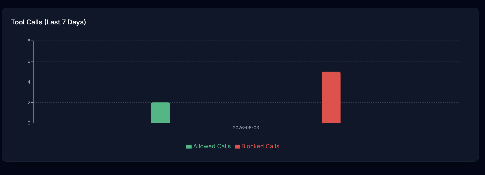
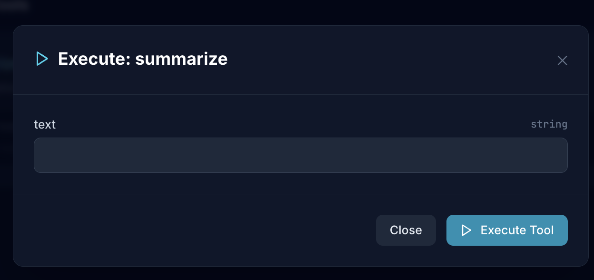
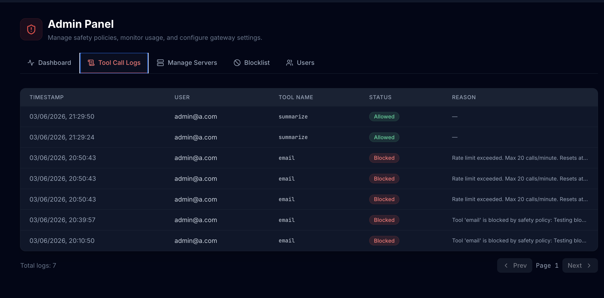

# Multi-Tenant Enterprise MCP Gateway

A secure control plane and MCP gateway for routing tenant-scoped tool calls to downstream Model Context Protocol (MCP) servers. The gateway exposes a standards-based Streamable HTTP MCP endpoint while retaining a legacy HTTP proxy for existing integrations.



## Highlights

- **Native MCP gateway:** authenticated clients connect to `/mcp` using MCP JSON-RPC over Streamable HTTP. The gateway aggregates `tools/list` results and routes `tools/call` requests to the correct downstream provider.
- **Multiple downstream transports:** register real MCP servers over Streamable HTTP or stdio; legacy `/call`-based servers remain supported for backwards compatibility.
- **Tenant isolation and RBAC:** all server discovery, routing, credentials, and audit records are scoped to a tenant. `admin`, `analyst`, and `viewer` roles control access.
- **Safety controls:** tool calls are blocklisted, sanitized, rate-limited (20 calls per user per minute), and audit logged before being forwarded.
- **Credential vault:** API keys are stored per user and server with AES-256-GCM encryption, then resolved only when a call requires them.
- **Operations UI and REST API:** React dashboard for servers, credentials, audit logs, tenants, and administration; REST endpoints remain available for management and legacy clients.
- **Automated quality checks:** Vitest/Supertest coverage for auth, RBAC, tenancy, vault isolation, rate limiting, safety, proxy behavior, and MCP gateway behavior, plus a benchmark script.

## Architecture

```text
MCP client ── Streamable HTTP + JWT ──> /mcp
                                          │
                         tenant/RBAC → safety → vault → audit log
                                          │
                ┌─────────────────────────┼─────────────────────────┐
                ▼                         ▼                         ▼
         MCP over stdio            MCP over HTTP             legacy HTTP /call
```

Tool names returned by the gateway are namespaced by server name (for example, `demo_calculator_stdio__calc_add`) to prevent collisions between downstream servers.

## Quick start

### Prerequisites

- Node.js 20 or later
- npm

### Install and configure

```bash
git clone <repo-url>
cd mcp-gateway
npm install
cp backend/.env.example backend/.env
```

The default SQLite database is created automatically at `backend/data/mcp_gateway.db`. Before deploying, replace the development `JWT_SECRET` and `VAULT_MASTER_KEY` values with strong secrets. The vault key must be a 32-byte, 64-character hexadecimal value.

### Seed the demo tenant

```bash
npm run seed --workspace=backend
```

This creates the `demo-enterprise` tenant and these accounts (all use password `Demo1234!`):

| Role | Email | Capabilities |
| --- | --- | --- |
| Admin | `admin@demo.com` | Server and policy administration, audit logs, tool calls |
| Analyst | `analyst@demo.com` | Tool calls and stored credentials |
| Viewer | `viewer@demo.com` | Browse-only access |

It also seeds a legacy HTTP server, a stdio calculator MCP server, and an HTTP weather/currency MCP server. Credentials are seeded for the analyst account.

### Run the application

```bash
npm run dev
```

- Frontend: http://localhost:5173
- REST API: http://localhost:4000/api
- MCP endpoint: http://localhost:4000/mcp

For a production build:

```bash
npm run build
npm run start --workspace=backend
```

## Using the MCP gateway

1. Log in through `POST /api/auth/login` and obtain the JWT.
2. Configure an MCP client with the Streamable HTTP URL `http://localhost:4000/mcp` and send the JWT as `Authorization: Bearer <token>` (or `X-Auth-Token`).
3. Use the normal MCP lifecycle: `initialize`, `tools/list`, then `tools/call`.

The gateway is stateless, so it is suitable for load-balanced deployments. Each request builds a tool view only from the caller's active tenant servers.

For every `tools/call`, the gateway verifies the caller's role and tenant ownership, applies the blocklist and parameter sanitization, checks the per-user rate limit, resolves any vaulted credential, forwards the call, and writes an audit record. Viewers can list tools but cannot execute them.

### Run the HTTP demo server

The seeded HTTP demo server listens at `http://127.0.0.1:8003/mcp`. Start it in a separate terminal:

```bash
npm run demo:http --workspace=backend
```

The seeded stdio calculator is launched automatically by the gateway on first use. It exposes `calc_add`, `calc_multiply`, and `get_sys_info`; the HTTP demo exposes `get_weather` and `convert_currency`.

## Registering downstream servers

Administrators can register servers through the UI or `POST /api/servers`. A registration accepts `transport_type` of `http`, `stdio`, or `legacy_http` (the default).

```json
{
  "name": "Inventory MCP",
  "base_url": "https://inventory.example.com/mcp",
  "transport_type": "http",
  "capabilities": ["inventory"]
}
```

For stdio servers, also provide `stdio_command` and optional `stdio_args`. For real MCP transports, tools are discovered with `tools/list`; legacy servers use their registered `tool_schema` and are called at `<base_url>/call`.

Store credentials separately with `POST /api/vault/store`; the supplied server must belong to the authenticated user's tenant. Keys are never returned by the API.

## API reference

| Method | Endpoint | Purpose | Access |
| --- | --- | --- | --- |
| POST | `/api/auth/register` | Create a tenant and its first admin | Public |
| POST | `/api/auth/login` | Obtain a JWT | Public |
| GET/POST | `/api/servers` | List or register tenant MCP servers | Authenticated / admin |
| POST | `/api/servers/seed` | Seed registry demo servers | Admin |
| POST | `/api/vault/store` | Encrypt and store an API key | Authenticated |
| GET | `/api/vault/keys` | List server IDs with stored keys | Authenticated |
| DELETE | `/api/vault/:serverId` | Delete the caller's stored key | Authenticated |
| GET | `/api/mcp/tools/search?q=<query>` | Search registered tools | Authenticated |
| POST | `/mcp` | MCP Streamable HTTP endpoint | JWT; analyst/admin to call tools |
| POST | `/api/proxy/:serverId/call` | Legacy proxy endpoint | Analyst/admin |
| GET | `/api/admin/logs` | Paginated tool-call audit logs | Admin |
| GET/POST/DELETE | `/api/admin/blocklist` | Manage safety blocklist | Admin |
| GET | `/api/health` | Service and database health | Public |

## Testing and benchmarking

Run the backend test suite:

```bash
npm run test --workspace=backend
```

For interactive testing or coverage:

```bash
npm run test:watch --workspace=backend
npm run test:coverage --workspace=backend
```

The tests use an in-memory SQLite database and cover the MCP gateway alongside authentication, authorization, tenant isolation, vault boundaries, safety policies, rate limiting, and legacy proxy behavior.

Run the in-memory gateway benchmark with:

```bash
npm run benchmark --workspace=backend
```

## Project layout

```text
backend/
  src/routes/mcpGateway.routes.ts  # Streamable HTTP MCP gateway
  src/services/mcpClientManager.ts # Downstream stdio/HTTP MCP client management
  src/scripts/                     # seed, demos, benchmark
  src/tests/                       # Vitest and Supertest suite
frontend/                          # React/Vite operations dashboard
docs/architecture.md               # Detailed architecture notes
```

## Screenshots

### Dynamic Tool Execution



### Admin Panel & Logs


