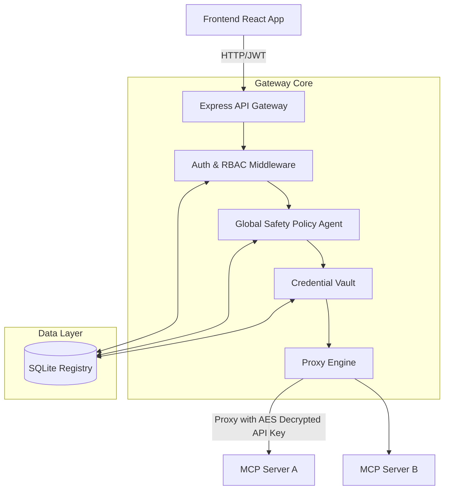

# System Architecture

The Multi-Tenant Enterprise MCP Gateway acts as a central proxy and safety plane between a unified Frontend Interface and downstream MCP (Model Context Protocol) servers. 

## System Overview

## Component Breakdown

1. **Frontend Interface (React/Vite)**
   - Provides a comprehensive Dashboard, MCP Server Registry, and Admin Panel.
   - Parses dynamic JSON schemas to auto-generate execution forms for MCP tools.
   - Interfaces strictly via REST with JWT Bearer authentication.

2. **Registry & Auth (Express & SQLite)**
   - Multi-tenant data model separating environments by `tenant_id`.
   - Role-Based Access Control (Admin, Analyst, Viewer).
   - Stateless JWT tokens (signed with `JWT_SECRET`) enforce API boundaries.

3. **Global Safety Policy Agent**
   - Intercepts every proxy request prior to execution.
   - **Rate Limiter**: Enforces strict limits (20 requests/minute) using an in-memory sliding window.
   - **Blocklist**: Cross-references tool names against a global database blocklist.
   - **Sanitization**: Deep-scans payloads for massive string lengths (> 10,000 characters) to prevent DoS.
   - **Audit Logging**: Asynchronously logs every passing and blocked call.

4. **Credential Vault (AES-256-GCM)**
   - MCP servers often require secret API keys. The gateway stores these securely using AES-256-GCM encryption.
   - Keys are dynamically decrypted just-in-time and injected into outgoing proxy headers.

## Technology Choices

| Technology | Justification |
|------------|---------------|
| **Express.js** | Lightweight, fast, and allows complete control over the middleware chain, which is critical for the safety and proxy layers. |
| **SQLite** | Zero-configuration SQL database perfectly suited for lightweight enterprise tools that are easily containerized. |
| **AES-256-GCM** | Industry standard authenticated encryption. Prevents tampering with the ciphertexts stored in the SQLite database. |
| **React Query** | Handles caching, loading states, and mutations gracefully in the frontend, preventing redundant network requests. |

## Future Scalability Considerations
While SQLite and in-memory rate limiting are extremely fast and sufficient for a single-node gateway deployment, an Enterprise scaling to multiple nodes should implement:

1. **PostgreSQL**: Migrate from SQLite to PostgreSQL for distributed ACID compliance.
2. **Redis**: Replace the in-memory Map inside `safetyMiddleware.ts` with a Redis instance (e.g. `redis-cli INCR`) to enforce rate limiting globally across all gateway nodes.
